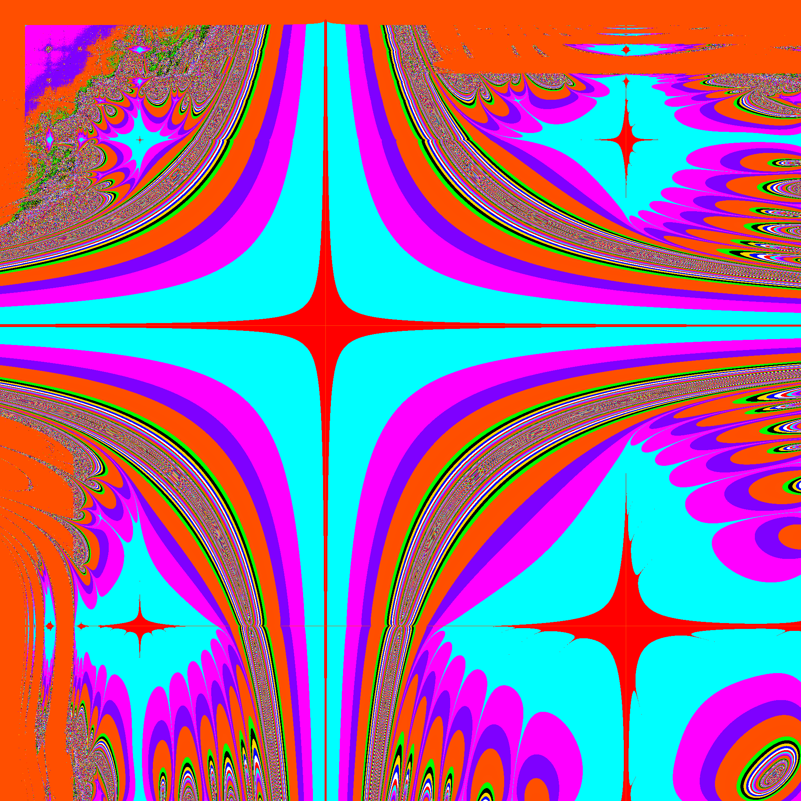

<div align="center">
  <picture>
    
  </picture>
</div>

# another_fractal_generator

Should probably work on linux, was tested on termux(android) and google colab.
<br>

## Installation
Requirements:
```sh
pip install numpy opencv-python
```
(on termux is necessary to `apt install x11-repo && apt update && apt install opencv && apt install opencv-python`)
<br>

```sh
git clone https://github.com/Ar57m/another_fractal_generator
cd another_fractal_generator
sh start.sh
```

<br>
start.sh builds and runs the generator, once is built you can just run the python file.

```sh
python runner.py
```
On that python script there is a lot of options to change if needed.
You can zoom into fractals(until some depth where precision limits hits).

<br>
<br>

## Fractals Implemented

Mandelbrot
<div align="center">
  <picture>
    
  </picture>
</div>

<br>

Juliaset
<div align="center">
  <picture>
    
  </picture>
</div>

<br>

Lyapunov
<div align="center">
  <picture>
    
  </picture>
</div>

<br>

Abelian Sandpile Fractal
<div align="center">
  <picture>
    
  </picture>
</div>


<br>
<br>
<br>

## Support me
If you find anything here useful consider helping a poor:

0x190ac445974a989a87dd223f212a76ca0090c804
